Name: Michias Shiferaw

Student ID: 300188168

## Example Runs:

### Sign Out

### 'Convert' mapping 

#### Celsius-fahrenheit

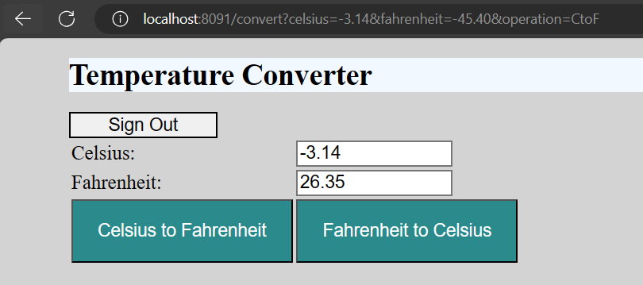

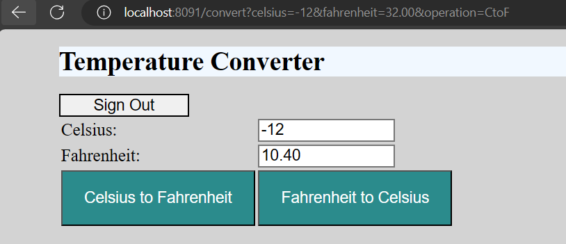

#### Fahrenheit-celsius

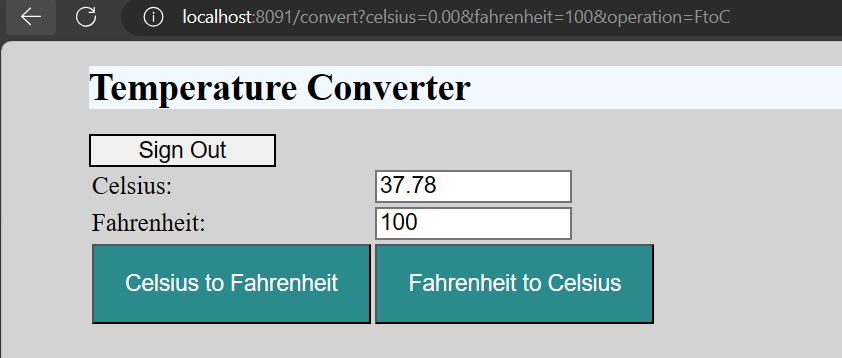

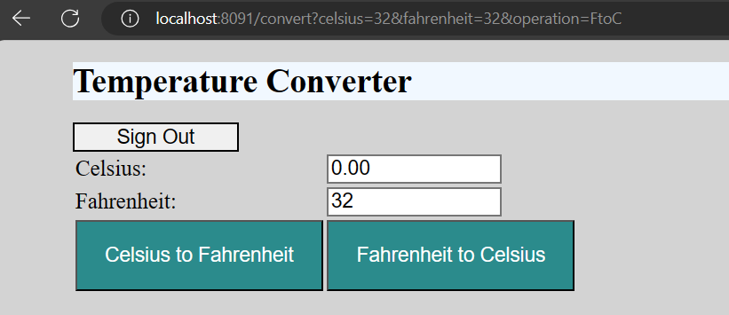

### Errors cases

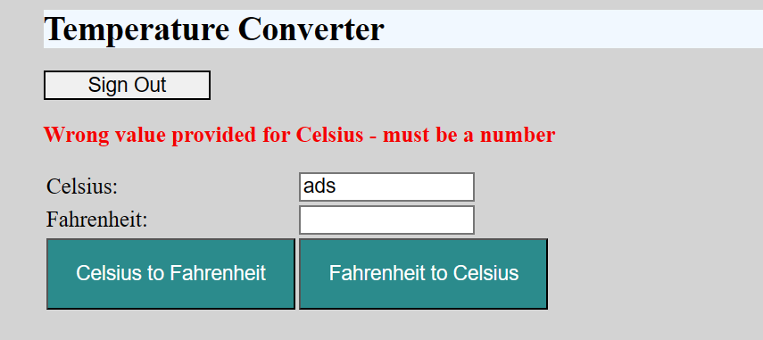

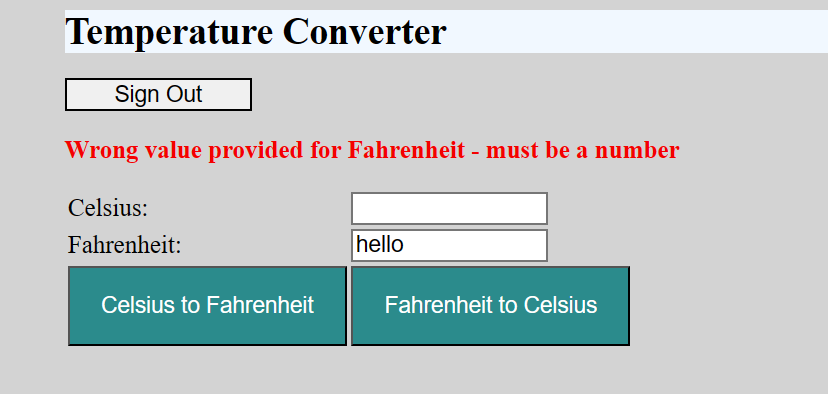

### 'temperature-converter' mapping

#### Celsius-fahrenheit

example format: http://localhost:8091/temperature-converter/celsius-fahrenheit/{**value**}

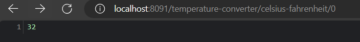

#### Fahrenheit-celsius

example format: http://localhost:8091/temperature-converter/celsius-fahrenheit/{**value**}

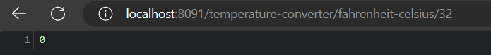

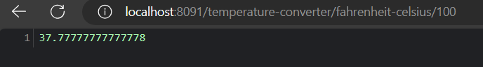

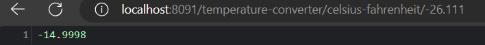

### Errors cases

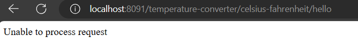

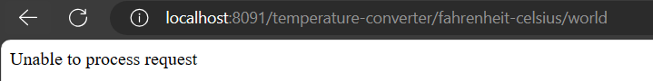

# lab6-converter
